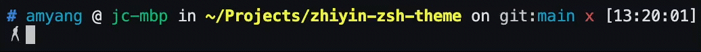

# Zhiyin-zsh-theme

Inspired by [Zhiyin](https://github.com/W-Mai/BuZhiYin), [emoji-ps1](https://github.com/bigomega/emoji-ps1) and built on [ys-zsh-theme](https://github.com/ohmyzsh/ohmyzsh/blob/master/themes/ys.zsh-theme)



## Installation

1. Install `Zhiyin.otf` font, select it in your iTerm2 (under Non-ASCII font) and add it to your VS Code's font family.
2. `cp zhiyin.zsh-theme ~/.oh-my-zsh/themes/`, or just add this [code snippet](https://github.com/AmyangXYZ/zhiyin-zsh-theme/blob/b2bf2ac7b4b7dbd68455863a31c632dc79558ef3/zhiyin.zsh-theme#L63-L150) to your favourite zsh theme.

For Windows WSL users, install Zhiyin.otf and configure your VSCode by adding this to the settings.json `"terminal.integrated.fontFamily": " 'Cascadia Mono',Menlo, Monaco, 'Courier New', monospace, Zhiyin"`.

## Zhiyin Sing

Sing upon ERR signal. Enable by adding below to `zhiyin.zsh-theme`, and copy `niganma.mp3` somewhere you like.

```shell
function zhiyin_sing {
    afplay ~/Downloads/niganma.mp3
}

trap zhiyin_sing ERR
```
